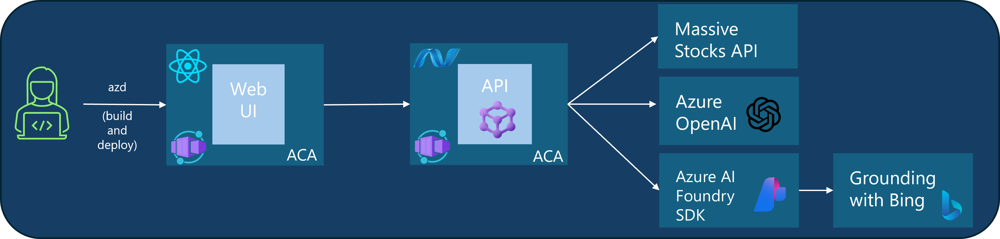

# Hands-on AI Orchestration using Microsoft Agent Framework Workshop

This hands-on workshop goes through the following lessons for creating intelligent AI agents using Microsoft Agent Framework as console applications:

1. [Prerequisites](pre-reqs.md)
1. [Lesson 1: Basic Agent Creation](lesson1.md)
1. [Lesson 2: Function Calling with Agents](lesson2.md)
1. [Lesson 3: Specialized Stock Sentiment Agent](lesson3.md)
1. [Lesson 4: Enhanced Financial Analysis with Web Search](lesson4.md)
1. [Lesson 5: Agent Orchestration with Sequential Workflows](lesson5.md)

Each lesson builds upon the previous one, teaching progressively more sophisticated Agent Framework concepts through practical financial advisory and portfolio analysis examples.

 
